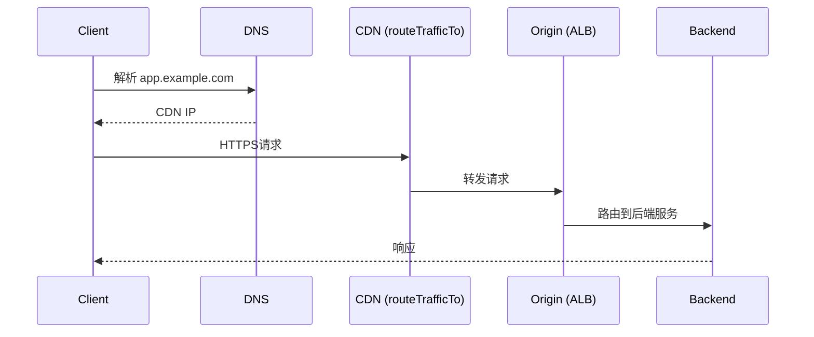
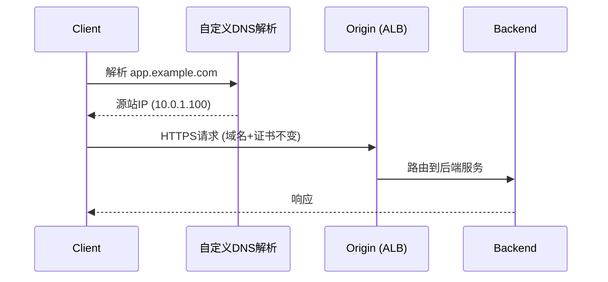

# 从源站请求原理

## 正常请求流程（经过CDN）



## 从源站请求流程（绕过CDN）


## 关键点

| 项目 | 正常请求 | 从源站请求 |
|------|---------|-----------|
| URL | 不变 | 不变 |
| Host Header | 不变 | 不变 |
| TLS/证书 | 正常匹配 | 正常匹配 |
| DNS解析 | 域名 -> CDN IP | 域名 -> 源站 IP |
| 经过CDN | 是 | 否 |

## 为什么不直接改URL？

```mermaid
flowchart TD
    subgraph 错误方式：直接改URL为源站域名
        A1[URL: https://alb-origin.example.com/api/xxx] --> B1[TLS握手]
        B1 --> C1[证书: *.example.com]
        C1 -->|域名不匹配| D1[证书验证失败]
    end

    subgraph 正确方式：自定义DNS解析
        A2[URL: https://app.example.com/api/xxx] --> B2[TLS握手]
        B2 --> C2[证书: *.example.com]
        C2 -->|域名匹配| D2[证书验证通过]
        D2 --> E2[TCP连接到源站IP]
    end
```

## 实现步骤

1. 从请求报文解析出域名：`app.example.com`
2. 查询流量层记录，获取 `originServer`：`alb-origin.example.com`
3. DNS解析 originServer 得到 IP：`10.0.1.100`
4. 创建自定义DNS的HTTP客户端：让原始域名解析到源站IP
5. 发起HTTPS请求：URL和证书都正常，但TCP连接直达源站
